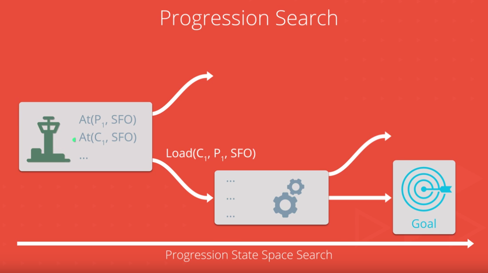

# Artificial Intelligence Engineer Nanodegree
## Search, Simulated Annealing, Constraint Satisfaction, Logic and Reasoning, and Planning
### Project: Implement a Planning Search
In this project, I defined a group of problems in classical PDDL (Planning Domain Definition Language) for the air cargo domain. I then setup the problems for search, experimented with various automatically generated heuristics, including planning graph heuristics, to solve the problems, and then provided an analysis of the results. Additionally, I wrote a short research review paper on the historical development of planning techniques and their use in artificial intelligence.

This project, from udacity, included skeletons for the classes and functions needed to solve deterministic logistics planning problems for an Air Cargo transport system using a planning search agent. With progression search algorithms, optimal plans for each problem will be computed.  Unlike the navigation problem, there is no simple distance heuristic to aid the agent. Instead, I implemented domain-independent heuristics!


All problems are in the Air Cargo domain.  They have the same action schema defined, but different initial states and goals.

- Air Cargo Action Schema:
```
Action(Load(c, p, a),
	PRECOND: At(c, a) ∧ At(p, a) ∧ Cargo(c) ∧ Plane(p) ∧ Airport(a)
	EFFECT: ¬ At(c, a) ∧ In(c, p))
Action(Unload(c, p, a),
	PRECOND: In(c, p) ∧ At(p, a) ∧ Cargo(c) ∧ Plane(p) ∧ Airport(a)
	EFFECT: At(c, a) ∧ ¬ In(c, p))
Action(Fly(p, from, to),
	PRECOND: At(p, from) ∧ Plane(p) ∧ Airport(from) ∧ Airport(to)
	EFFECT: ¬ At(p, from) ∧ At(p, to))
```

- Problem 1 initial state and goal:
```
Init(At(C1, SFO) ∧ At(C2, JFK) 
	∧ At(P1, SFO) ∧ At(P2, JFK) 
	∧ Cargo(C1) ∧ Cargo(C2) 
	∧ Plane(P1) ∧ Plane(P2)
	∧ Airport(JFK) ∧ Airport(SFO))
Goal(At(C1, JFK) ∧ At(C2, SFO))
```
- Problem 2 initial state and goal:
```
Init(At(C1, SFO) ∧ At(C2, JFK) ∧ At(C3, ATL) 
	∧ At(P1, SFO) ∧ At(P2, JFK) ∧ At(P3, ATL) 
	∧ Cargo(C1) ∧ Cargo(C2) ∧ Cargo(C3)
	∧ Plane(P1) ∧ Plane(P2) ∧ Plane(P3)
	∧ Airport(JFK) ∧ Airport(SFO) ∧ Airport(ATL))
Goal(At(C1, JFK) ∧ At(C2, SFO) ∧ At(C3, SFO))
```
- Problem 3 initial state and goal:
```
Init(At(C1, SFO) ∧ At(C2, JFK) ∧ At(C3, ATL) ∧ At(C4, ORD) 
	∧ At(P1, SFO) ∧ At(P2, JFK) 
	∧ Cargo(C1) ∧ Cargo(C2) ∧ Cargo(C3) ∧ Cargo(C4)
	∧ Plane(P1) ∧ Plane(P2)
	∧ Airport(JFK) ∧ Airport(SFO) ∧ Airport(ATL) ∧ Airport(ORD))
Goal(At(C1, JFK) ∧ At(C3, JFK) ∧ At(C2, SFO) ∧ At(C4, SFO))
```

## Getting Started

To get this code on your machine you can fork the repo or open a terminal and run this command.
```sh
git clone https://github.com/JonathanKSullivan/Air-Cargo-Planning-Problem
```

### Prerequisites

This project requires **Python 3** and the following Python libraries installed:

- [NumPy](http://www.numpy.org/)
- [SciPy](https://www.scipy.org/)
- [scikit-learn](http://scikit-learn.org/0.17/install.html)
- [pandas](http://pandas.pydata.org/)
- [matplotlib](http://matplotlib.org/)
- [jupyter](http://ipython.org/notebook.html)
- [hmmlearn](http://hmmlearn.readthedocs.io/en/latest/)

##### Notes: 

- Starter code included a copy of [companion code](https://github.com/aimacode) for the Stuart Russel/Norvig AIMA text.  

It is highly recommended that you install the [Anaconda](http://continuum.io/downloads) distribution of Python and load the environment included below.
I used pygame to help me visualize my programs so that I have beautiful visualizations of AI I can share with others in your portfolio. However, pygame is optional as it can be tricky to install. 

### Installing
#### Mac OS X and Linux
1. Download the `aind-environment-unix.yml/aind-environment-unix.yml`/`aind-environment-osx.yml` file at the bottom of this section.
2. Run `conda env create -f aind-environment-unix.yml`(or `aind-environment-osx.yml`) to create the environment.
then source activate aind to enter the environment.
3. Install the development version of hmmlearn 0.2.1 with a source build: `pip install git+https://github.com/hmmlearn/hmmlearn.git`. 

#### Windows
1. Download the `aind-environment-windows.yml` file at the bottom of this section.
2. `conda env create -f aind-environment-windows.yml` to create the environment.
then activate aind to enter the environment.
3. Install the development version of hmmlearn 0.2.1 in one of the following ways. 
    ##### Source build
    1. Download the Visual C++ Build Tools [here](http://landinghub.visualstudio.com/visual-cpp-build-tools).
    `pip install git+https://github.com/hmmlearn/hmmlearn.git`
    ##### Precompiled binary wheel
    1. Download the appropriate `hmmlearn-0.2.1-yourpythonwindows.whl` file from here
    2. Install with `pip install hmmlearn-0.2.1-yourpythonwindows.whl`.

#### Optional: Install Pygame
I used pygame to help you visualize my programs so that I have beautiful visualizations of AI I can share with others in my portfolio. 
##### Mac OS X
1. Install [homebrew](http://brew.sh/)
2. `brew install sdl sdl_image sdl_mixer sdl_ttf portmidi mercurial`
3. `source activate aind`
4. `pip install pygame`
Some users have reported that pygame is not properly initialized on OSX until you also run `python -m pygame.tests`.

Windows and Linux
1. `pip install pygame`
2. In Windows, an alternate method is to install a precompiled binary wheel:
    1. Download the appropriate `pygame-1.9.3-yourpythonwindows.whl` file from here
    2. Install with `pip install pygame-1.9.3-yourpythonwindows.whl`.


Download the one of the following yml files:
[aind-environment-osx.yml](https://d17h27t6h515a5.cloudfront.net/topher/2017/April/58ee7e68_aind-environment-macos/aind-environment-macos.yml)
[aind-environment-unix.yml](https://d17h27t6h515a5.cloudfront.net/topher/2017/April/58ee7eff_aind-environment-unix/aind-environment-unix.yml)
[aind-environment-windows.yml](https://d17h27t6h515a5.cloudfront.net/topher/2017/April/58ee7f6c_aind-environment-windows/aind-environment-windows.yml)

## Running the tests

- The planning problem for the "Have Cake and Eat it Too" problem  has been implemented by udacity in the `example_have_cake` module as an example.
- The `tests` directory includes `unittest` test cases to evaluate your implementations. From the AIND-Planning directory command line:
    - `python -m unittest tests.test_my_air_cargo_problems`
    - `python -m unittest tests.test_my_planning_graph`

## Deployment
- The `run_search` script is provided for gathering metrics for various search methods on any or all of the problems and should be used for this purpose.

## Built With

* [Jupyter](http://www.http://jupyter.org/) - The Document Editor used
* [Anaconda](https://www.continuum.io/downloads) - The data science platform used
* [hmmlearn](https://github.com/hmmlearn/hmmlearn) - Python Hidden Markov Models API used 

## Authors
* **Udacity** - *Initial work* - [Air-Cargo-Planning-Problem](https://github.com/JonathanKSullivan/Air-Cargo-Planning-Problem)
* **Jonathan Sulivan** - *Build Model* -

## Acknowledgments
* Hackbright Academy
* Udacity
* "Artificial Intelligence: A Modern Approach" 

